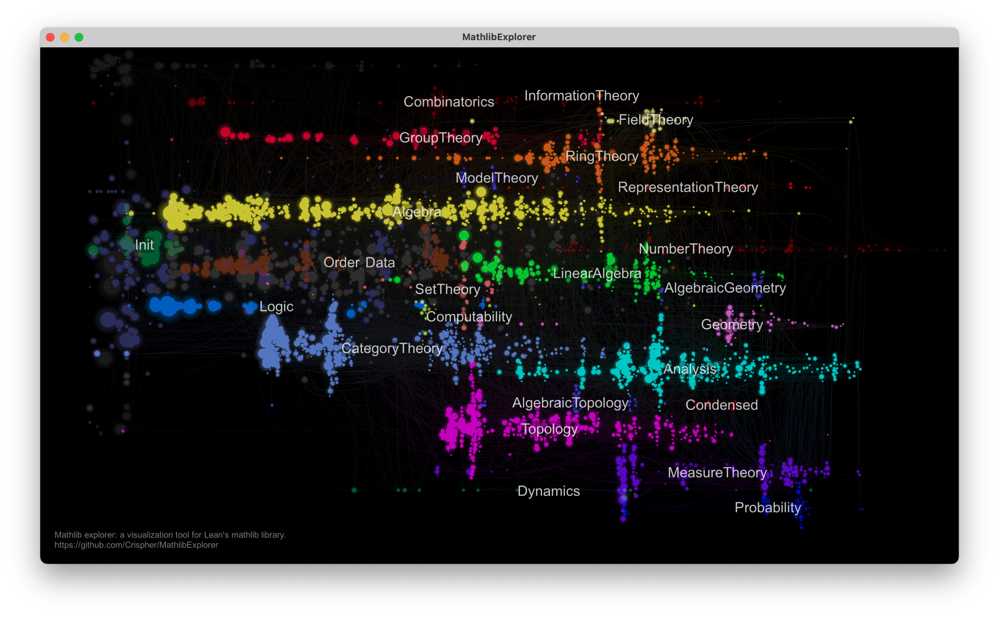
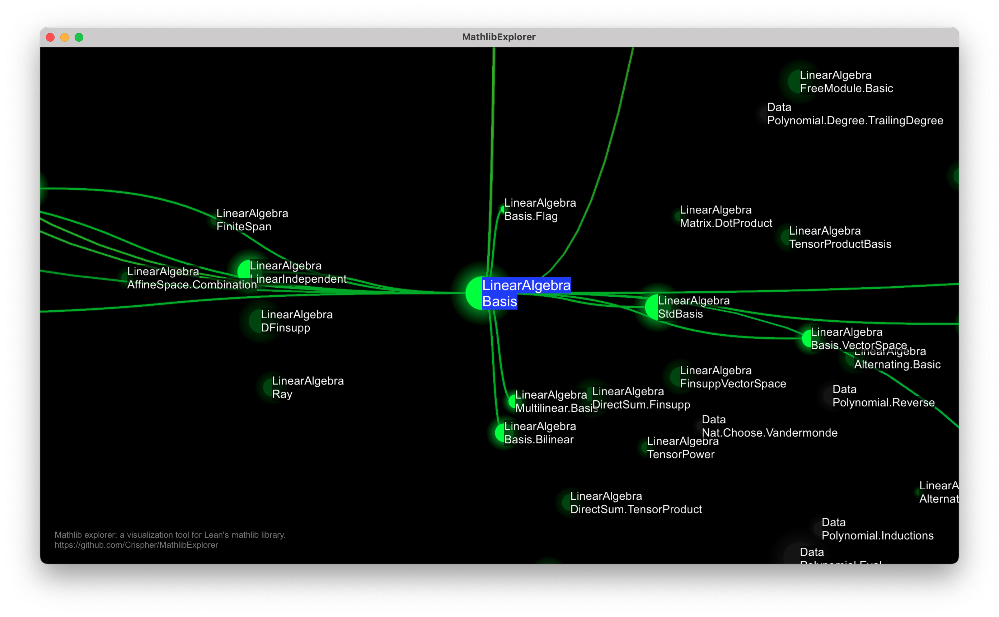

# MathlibExplorer

Mathlib explorer is a visualization tool designed specifically for [Lean&#39;s mathlib library](https://github.com/leanprover-community/mathlib4).
It visualizes the import relations between source files in mathlib, and allows users to explore the library in a more intuitive way.

<!-- include screenshots -->



Zoom in view:


## Features

The import graph is mapped onto the plane, s.t. if B imports A, B will always be on the right of A. This makes it easy to see how
modern math theories are constructed from axioms and definitions.

Supported interactions:

- Zoom in/out
- Drag to move
- Click on a node to highlight
  - its direct neighbors
  - its transitive dependents
  - its transitive dependencies
- Click on a topic label to highlight
  - all nodes in the same topic
  - references to the topic
  - direct dependencies of the topic

## Usage

Clone this repo:
```
git clone https://github.com/Crispher/MathlibExplorer
```
Go to the binary folder of your platform:
```
cd MathlibExplorer/release/bin_{YOUR_PLATFORM}
```
Run the executable:
```
./MathlibExplorer
```

## Credits

Cross-platform graphics is powered by [bgfx](https://github.com/bkaradzic/bgfx).
